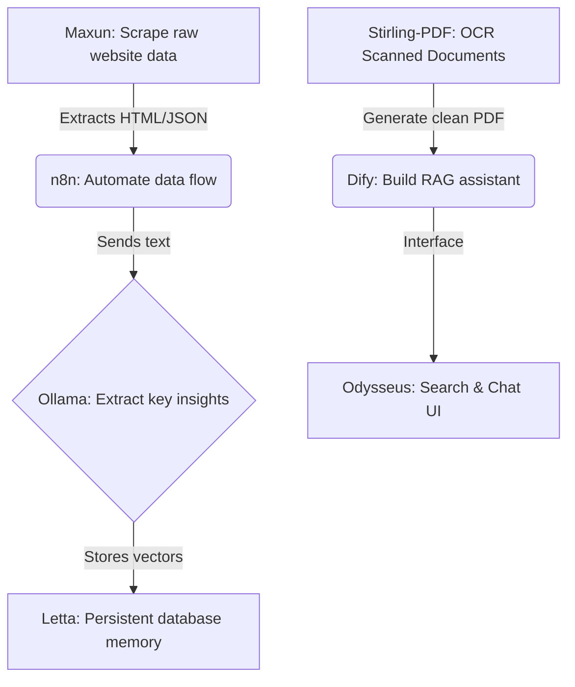

# Local AI Tools & Comparison Guide

This guide provides an in-depth breakdown of every tool in your `/Users/hassan/local-ai` workspace. It covers core capabilities, setup, comparison to commercial SaaS (like ChatGPT, Claude, Midjourney, and Zapier), limitations, and specialized niches.

---

## 🗺️ Quick Tool Matrix

| Tool | Category | SaaS Equivalent | Key Niche | Port |
| :--- | :--- | :--- | :--- | :--- |
| **Odysseus** | Core Workspace | ChatGPT (Web) | Local search, RAG, custom tool execution | `7070` |
| **Ollama** | Model Runtime | OpenAI API / Groq | Running models on Mac M1 Pro GPU | `11434` |
| **Dify** | LLM Orchestration | ChatGPT Builder / Coze | Enterprise RAG & complex workflows | `8090` |
| **Letta** | Stateful Agents | ChatGPT (with Memory) | Long-term memory agents (MemGPT) | `8283` |
| **Aider** | Code Assistant | Cursor / Claude Dev | Fast command-line git-integrated coding | CLI / `8501` |
| **ComfyUI** | Media Generation | Midjourney | Professional node-based image generation | `8188` |
| **Fooocus** | Media Generation | Midjourney / DALL-E | Simple prompting for premium images | `8096` |
| **Open WebUI** | Chat Interface | ChatGPT Plus | Ingesting large files with custom RAG | `3000` |
| **n8n** | Workflow Automation | Zapier / Make.com | AI agents hooked into actual web APIs | `5678` |
| **Langflow** | Visual Agent RAG | Flowise | Prototyping custom LangChain graphs | `7860` |
| **Stirling-PDF** | Document Utility | Adobe Acrobat Pro | Local, offline PDF modifications | `8082` |
| **Maxun** | Web Scraper | Apify / Octoparse | Visual click-and-extract web scraping | `8086` |
| **OpenHands** | Autonomous Coder | Devin | Setting up a sandbox to write software | `3001` |

---

## 1. Core Runtime & Workspace

### 🦙 Ollama
*   **What it is:** The engine that runs local weights (like Llama 3, Gemma 2, or DeepSeek-R1) directly on your Apple Silicon Mac.
*   **SaaS Comparison:** Replaces commercial APIs (OpenAI, Anthropic, Groq).
*   **Niche:** Standardizing local model hosting. It exposes an OpenAI-compatible API on `http://localhost:11434/v1`.
*   **Setup Internals:**
    *   Models are downloaded directly to `~/.ollama/models`.
    *   Uses your Mac's M1 Pro unified memory (shared VRAM/RAM) to execute models using Metal GPU acceleration.
*   **What you can accomplish:** Fully offline RAG, offline coding completion, and offline chat with zero data leakage.
*   **Limitations:** Limited by your hardware's VRAM. A 32GB Mac can comfortably run models up to 32B parameters (e.g., DeepSeek-R1:32b). 70B+ models will run in CPU-only mode at extremely slow token-generation speeds.

---

### ⛵ Odysseus
*   **What it is:** A self-hosted, central workspace dashboard that serves as a portal for all other tools and handles local file organization, search integration (SearXNG), and MCP servers.
*   **SaaS Comparison:** Replaces the core ChatGPT Plus Web interface, but includes local file management.
*   **Niche:** Privacy-focused searching and local database chat.
*   **Setup Internals:**
    *   Runs via Docker Compose.
    *   Connects to Ollama on host via `http://host.docker.internal:11434/v1`.
    *   Exposed on **[http://localhost:7070](http://localhost:7070)**.
    *   Stores indexing data in local SQLite (`data/app.db`) and vector data in a ChromaDB container.
*   **What you can accomplish:** Search the web locally (via SearXNG) without Google tracking your queries; index personal directories and documents locally and ask queries about them.
*   **Limitations:** RAG indexing is basic compared to dedicated tools like Dify. It is designed for fast, single-directory lookups rather than complex multi-database schemas.

---

## 2. LLM Orchestration & Workflows

### 🧩 Dify
*   **What it is:** An enterprise-grade platform for building LLM applications, agents, and complex RAG pipelines visually.
*   **SaaS Comparison:** Replaces ChatGPT Custom GPTs, Custom Assistants, and custom LangChain code.
*   **Niche:** Visually designing structured agent steps, variables, and multi-document RAG databases.
*   **Setup Internals:**
    *   Runs inside Docker. Configured with PostgreSQL for storage and Redis for caching.
    *   Exposed on **[http://localhost:8090](http://localhost:8090)**.
    *   Requires you to add Ollama as a model provider inside Dify's Settings (`http://host.docker.internal:11434`).
*   **What you can accomplish:** Build a customer support chatbot that reads specific company PDFs, calls local APIs to fetch database info, and outputs structured JSON.
*   **Limitations:** High resource footprint (runs ~8 containers). Requires configuration of system prompts, chunking sizes, and vector matching thresholds manually.

---

### 🔀 n8n
*   **What it is:** A node-based workflow automation engine that links APIs, apps, and local LLMs together.
*   **SaaS Comparison:** Replaces Zapier and Make.com.
*   **Niche:** Automating repetitive tasks (like parsing emails or scraping web pages) and feeding that data into local LLMs.
*   **Setup Internals:**
    *   Runs via Docker.
    *   Exposed on **[http://localhost:5678](http://localhost:5678)**.
    *   Communicates with Ollama and local databases via the bridge network.
*   **What you can accomplish:** Set up an automation that watches your inbox, pulls new PDF invoices, sends them to Llama 3 to extract the total amount, and appends the results to a Google Sheet.
*   **Limitations:** Designed for batch processing or event-driven tasks, not for building interactive conversational interfaces (use Dify for chat).

---

### 🎨 Langflow
*   **What it is:** A visual prototyping tool for building LangChain pipelines and multi-agent state charts.
*   **SaaS Comparison:** Replaces raw LangChain code writing.
*   **Niche:** Visualizing how different embedding models, memory windows, and prompt templates connect.
*   **Setup Internals:**
    *   Runs via Docker.
    *   Exposed on **[http://localhost:7860](http://localhost:7860)**.
*   **What you can accomplish:** Visually construct and test a custom RAG graph that uses hierarchical agent planning.
*   **Limitations:** Great for prototyping, but translating Langflow templates into stable, high-scale production apps is more difficult than using Dify.

---

## 3. Coding Assistants

### 🤖 Aider
*   **What it is:** A CLI tool that acts as a pair programmer, editing code directly inside your local Git repository.
*   **SaaS Comparison:** Replaces Cursor Composer, Copilot Workspace, and Claude Dev (Devin CLI alternative).
*   **Niche:** Fast, precise code modifications. You tell it what to do in plain English, and it writes code, creates git commits, and updates the repository map.
*   **Setup Internals:**
    *   Runs locally inside your conda python environment.
    *   Exposes a Streamlit GUI on **[http://localhost:8501](http://localhost:8501)** when run with the `--gui` flag.
    *   Reads `~/.continue/` configs and local `.env` variables to call Gemini or local Ollama models.
*   **What you can accomplish:** Implement features, refactor files, fix bug loops, and write test suites across multiple files simultaneously.
*   **Limitations:** High token consumption. Best run on powerful models (like `gemini-2.5-flash` or `claude-3-5-sonnet`) to ensure it doesn't break code logic on larger repositories.

---

### 🧤 OpenHands
*   **What it is:** An autonomous AI software engineer that operates inside a secure Docker container sandbox to write, compile, and debug applications.
*   **SaaS Comparison:** Direct competitor to Devin.
*   **Niche:** Fully autonomous, end-to-end task completion (e.g. "Create a complete React project and deploy it").
*   **Setup Internals:**
    *   Spawns a specialized sandboxed runtime container to run commands safely on your behalf.
    *   Exposed on **[http://localhost:3001](http://localhost:3001)**.
*   **What you can accomplish:** Let the agent attempt to build entire components, install third-party dependencies, test them, and debug output errors without you touching the keyboard.
*   **Limitations:** Heavy resource consumption. Because it runs commands in a loop, it can consume a large amount of API credits or local CPU if it gets stuck in an infinite debugging loop.

---

## 4. Stateful Agent Servers

### 🧠 Letta
*   **What it is:** A stateful agent server (based on MemGPT) that gives AI agents virtual memory, allowing them to remember facts across weeks or months.
*   **SaaS Comparison:** Replaces the OpenAI Assistants API thread storage.
*   **Niche:** Long-term conversational history and personalized memory.
*   **Setup Internals:**
    *   Uses a PostgreSQL database (`letta-db`) with `pgvector` to store long-term semantic embeddings.
    *   Exposed on **[http://localhost:8283](http://localhost:8283)**.
*   **What you can accomplish:** Build an executive assistant agent that recalls details from conversations you had weeks ago, and refines its understanding of your preferences over time.
*   **Limitations:** Higher setup overhead. Schema modifications require database migrations. Latency is slightly higher due to the agent constantly saving and retrieving from vector memories.

---

## 5. Creative Image Generation

### 🖼️ Fooocus
*   **What it is:** An optimized image generation UI based on SDXL (Stable Diffusion XL) and Flux.
*   **SaaS Comparison:** Midjourney and DALL-E 3.
*   **Niche:** High-quality image generation without dealing with complex configurations.
*   **Setup Internals:**
    *   Runs locally, leveraging Apple Silicon GPU via PyTorch MPS.
    *   Exposed on **[http://localhost:8096](http://localhost:8096)**.
*   **What you can accomplish:** Generate photorealistic human portraits, anime art, or architectural renders with simple prompts.
*   **Limitations:** Lacks the deep, step-by-step pipeline control of ComfyUI. Great for standard prompting, but not for complex layout manipulation or video generation.

---

### 🎛️ ComfyUI
*   **What it is:** A node-based graph interface for Stable Diffusion, SD3, and Flux, offering complete control over the image generation pipeline.
*   **SaaS Comparison:** Replaces advanced Photoshop generative tools and Midjourney parameters.
*   **Niche:** Advanced workflows, image-to-image manipulation, control-net guidance, and batch rendering.
*   **Setup Internals:**
    *   Runs locally inside your conda python environment.
    *   Exposed on **[http://localhost:8188](http://localhost:8188)**.
*   **What you can accomplish:** Use a control net to force the generated character to match a specific pose; perform face-swapping; generate short animations based on text inputs.
*   **Limitations:** Steep learning curve. The interface is complex, and you must manually connect nodes (load checkpoints, prompt encoders, samplers, decoders).

---

## 6. Document & Data Utilities

### 📄 Stirling-PDF
*   **What it is:** A fully-featured web application that performs all PDF utilities (compressing, OCR, splitting, signing, merging) locally.
*   **SaaS Comparison:** Replaces Adobe Acrobat Pro, Smallpdf, and ILovePDF.
*   **Niche:** Offline, batch PDF editing with zero document privacy leaks.
*   **Setup Internals:**
    *   Runs inside a lightweight Docker container.
    *   Exposed on **[http://localhost:8082](http://localhost:8082)**.
*   **What you can accomplish:** Perform OCR (Optical Character Recognition) on scanned documents; redact private data; merge multiple formats into clean, searchable PDFs.
*   **Limitations:** It is a utility tool, not an AI agent. It does not read or summarize the PDFs (use Odysseus or Dify for that).

---

### 🕸️ Maxun
*   **What it is:** A visual web scraper that lets you extract data from any website by pointing and clicking.
*   **SaaS Comparison:** Replaces Apify and custom Puppeteer scrapers.
*   **Niche:** Scraping dynamic websites (React/Angular) without writing coding scripts.
*   **Setup Internals:**
    *   Runs inside Docker, launching a headless browser.
    *   Exposed on **[http://localhost:8086](http://localhost:8086)**.
*   **What you can accomplish:** Create a scraper that pulls product prices from an e-commerce site daily and outputs a clean JSON file.
*   **Limitations:** Sites with heavy anti-bot mechanisms (like Cloudflare Turnstile) may block the scraper unless you integrate residential proxies.

---

## 🤖 Direct SaaS vs. Local AI Comparison

| Feature | Commercial SaaS (ChatGPT/Claude/Midjourney) | Local AI Suite (Odysseus/Ollama/ComfyUI) |
| :--- | :--- | :--- |
| **Privacy** | ❌ Data is sent to cloud servers and potentially used for training. |  Zero data leakage. Everything stays on your SSD and RAM. |
| **Cost** | ❌ Monthly subscription fees + API pay-as-you-go costs. |  Free (after hardware purchase). Unlimited usage. |
| **Offline Capability**| ❌ Fails completely without internet. |  Runs offline (except for cloud-model API fallbacks). |
| **Speed** |  Super fast due to massive server clusters. | ⚠️ Highly dependent on Mac hardware (M1 Pro GPU generation speed). |
| **Customization** | ❌ Closed platform, restricted customization and system prompts. |  Infinite customization. Modify any code, system rules, or weights. |
| **Content Filters** | ❌ Heavy safety filters can block creative/business use cases. |  No filters (if using uncensored model weights). |

---

## 🔗 Integration Guide: How to Connect the Stack

Your local suite is designed to function as an interconnected ecosystem. Here is an example of how you can combine these tools:

### Example Workflows:
1.  **AI-Generated Newsletter**: Use **Maxun** to scrape AI articles daily, **n8n** to parse the articles and pass them to **Ollama** (Llama 3) for summarization, and **n8n** to format the newsletter.
2.  **Codebase Expansion**: Use **Aider** to construct a Python script. If the script fails, pipe the errors to **OpenHands** inside a sandboxed container to auto-debug, compile, and run it.
3.  **Visual Asset Builder**: Ingest a design document through **Odysseus**, prompt **Ollama** to create a highly detailed scene description, and send that description directly to **ComfyUI** or **Fooocus** to generate the final graphic assets.
